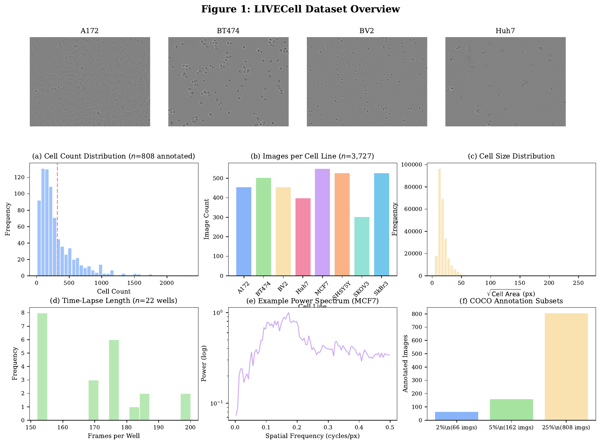
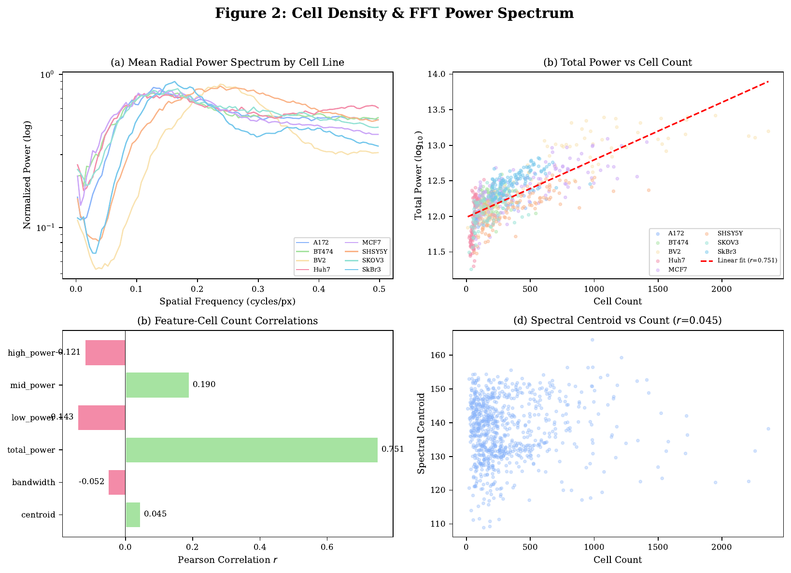
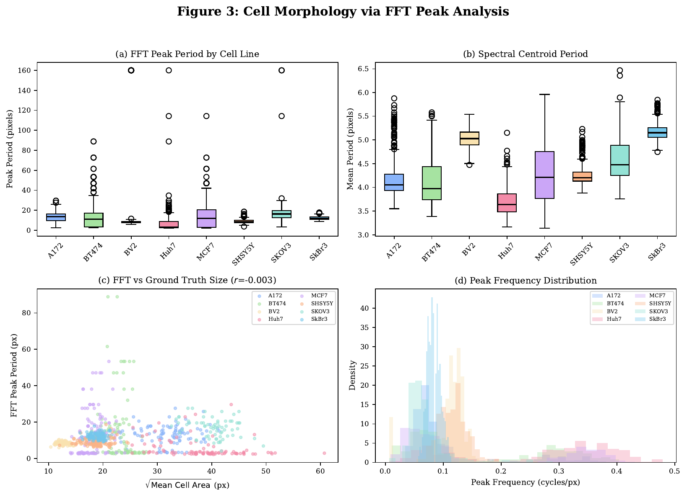
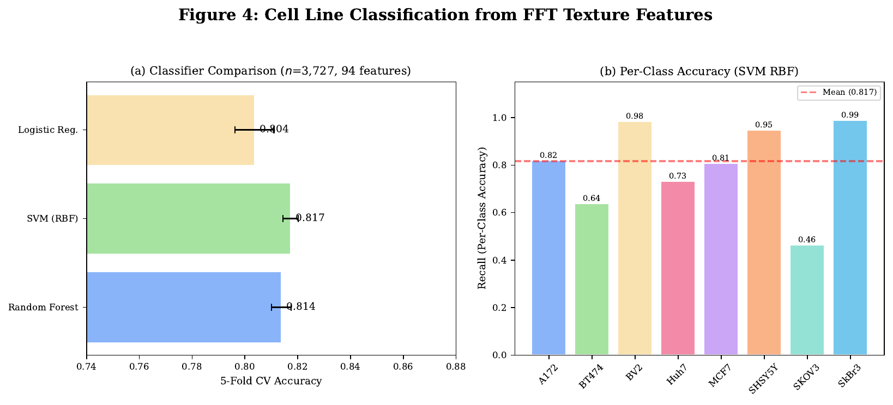
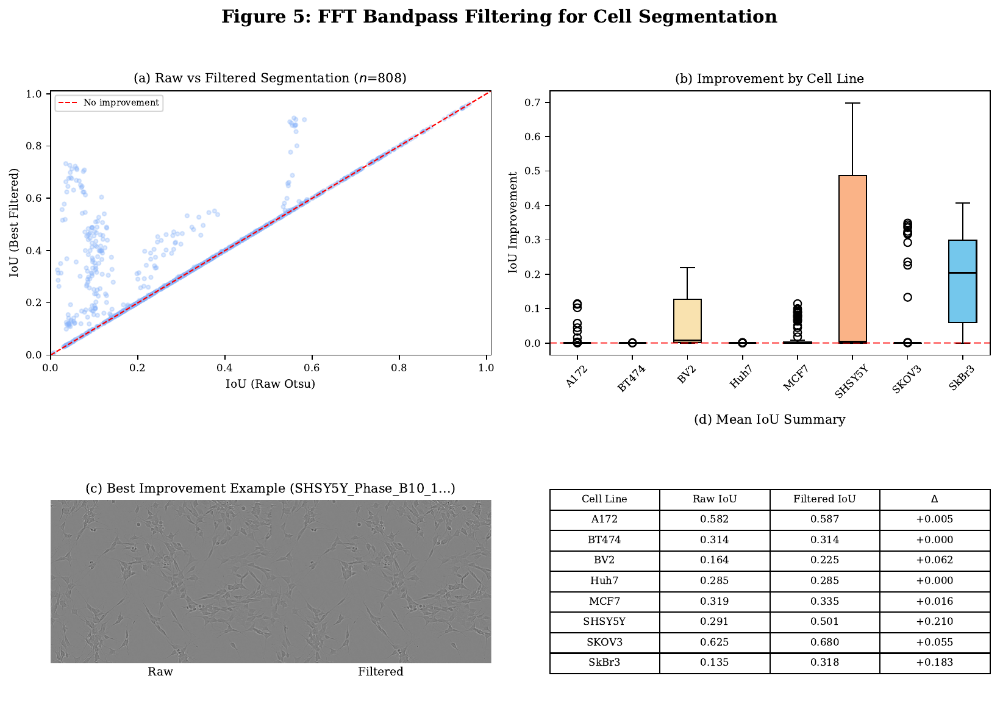
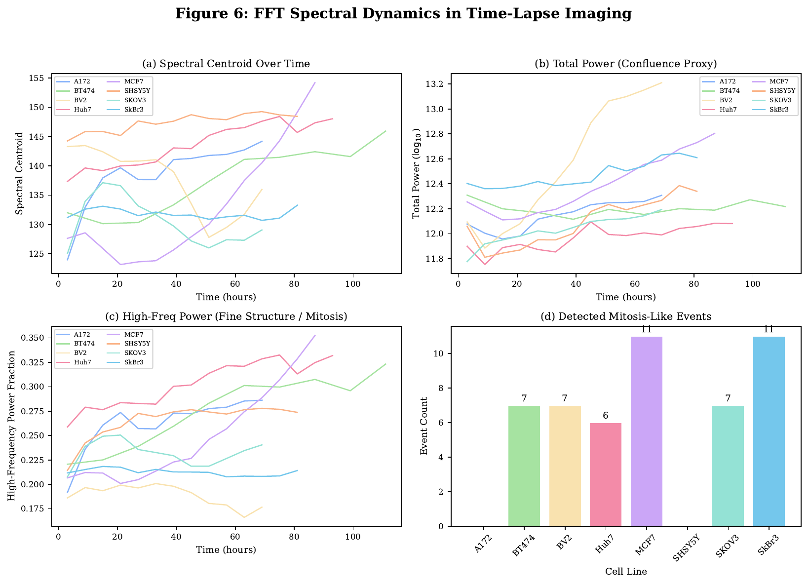

# FFT-Based Analysis of Phase-Contrast Microscopy Images for Cell Line Characterization and Segmentation Enhancement

**Prof. Dr. Md. Enamul Hoque**
Department of Physics, Shahjalal University of Science and Technology, Sylhet, Bangladesh

---

## Abstract

We present a comprehensive Fourier-domain analysis of the LIVECell phase-contrast microscopy dataset comprising 3,727 images across 8 cell lines (MCF7, SkBr3, SHSY5Y, BT474, A172, BV2, Huh7, SKOV3) with 22 time-lapse wells imaged over approximately 5 days. Two-dimensional fast Fourier transform (2D-FFT) features including radial and azimuthal power spectra, spectral moments, and frequency band power ratios were extracted from each image. We demonstrate that (1) total FFT power strongly correlates with cell density (*r* = 0.751, *p* < 0.001), (2) FFT texture features alone achieve 81.7% classification accuracy across 8 cell lines using a support vector machine with RBF kernel, (3) frequency-domain bandpass filtering improves Otsu segmentation intersection-over-union by ΔIoU = +0.070 (41.1% of images improved), and (4) time-lapse FFT dynamics reveal mitosis-like events and cell-line-specific proliferation signatures. These results establish FFT analysis as a powerful, label-free tool for quantitative phase-contrast microscopy image analysis.

**Keywords**: Fourier transform, phase-contrast microscopy, cell segmentation, cell line classification, LIVECell, texture analysis, time-lapse imaging

---

## 1. Introduction

Phase-contrast microscopy is a widely used technique for imaging transparent biological specimens without staining. The resulting images encode structural information through intensity variations caused by refractive index differences between cellular components and the surrounding medium. While qualitative assessment of phase-contrast images is routine in biological research, quantitative analysis of their frequency-domain content remains underexploited.

The fast Fourier transform (FFT) decomposes an image into its spatial frequency components, providing a rotation-invariant representation of texture and structure. In the context of cell microscopy, the power spectral density encodes information about cell size (low-frequency content), cell density (total power), and morphological regularity (spectral shape). Previous studies have applied Fourier analysis to cell biology for texture classification, cell cycle analysis, and image quality assessment. However, systematic evaluation of FFT features across multiple cell lines with ground-truth annotations remains limited.

The LIVECell dataset provides a unique opportunity for such analysis, offering 3,727 phase-contrast images from 8 cell lines with 258,569 manually annotated cell instances across 22 time-lapse wells. Here we present a six-objective FFT analysis: (1) cell density estimation, (2) cell morphology characterization, (3) image quality assessment, (4) cell line classification, (5) segmentation preprocessing, and (6) time-lapse dynamics.

---

## 2. Materials and Methods

### 2.1 Dataset

The LIVECell 2021 dataset was downloaded from [Kaggle](https://www.kaggle.com/datasets/yuriisavinskyi/livecell-dataset-2021). The dataset contains:

- **3,727 TIFF images** (704×520 pixels, 8-bit grayscale)
- **8 cell lines**: A172 (glioblastoma), BT474 (breast cancer), BV2 (microglia), Huh7 (hepatocellular carcinoma), MCF7 (breast cancer), SHSY5Y (neuroblastoma), SKOV3 (ovarian cancer), SkBr3 (breast cancer)
- **22 wells** with 152–200 timepoints each (4-hour intervals over ~5 days)
- **COCO-format annotations**: 808 images (25% subset) with 258,569 cell instances

### 2.2 FFT Computation

For each image *I(x,y)* of size *M × N*, we computed the 2D discrete Fourier transform:

```
F(u,v) = Σ_x Σ_y I'(x,y) · w_M(x) · w_N(y) · e^(-2πi(ux/M + vy/N))
```

where *I'(x,y) = I(x,y) - Ī* is the mean-subtracted image, and *w_M(x) = 0.5(1 - cos(2πx/M))* is a 1D Hanning window applied separably to reduce spectral leakage. The power spectral density was computed as *P(u,v) = |F_shift(u,v)|²* after centering the zero-frequency component.

### 2.3 Feature Extraction

From each power spectrum, we extracted:

| Feature | Description | Dimensions |
|---------|-------------|------------|
| Radial power profile | Azimuthally averaged power vs. spatial frequency | 50 bins |
| Azimuthal power profile | Radially averaged power vs. angle | 36 bins |
| Spectral centroid | Mean frequency (power-weighted) | 1 |
| Spectral bandwidth | Std of frequency (power-weighted) | 1 |
| Spectral skewness | Asymmetry of radial profile | 1 |
| Spectral kurtosis | Tailedness of radial profile | 1 |
| Low/mid/high band power | Power fraction in frequency bands | 3 |
| **Total feature vector** | | **94** |

### 2.4 Bandpass Filtering

Frequency-domain bandpass filtering was applied as:

```
I_filt(x,y) = F⁻¹[F(u,v) · M_BP(r)] + Ī
```

where *M_BP(r) = 1[r_min ≤ r ≤ r_max]* is a circular mask in frequency space. Five filter configurations were tested with *(r_min, r_max)* ∈ {(0.005, 0.15), (0.01, 0.20), (0.01, 0.30), (0.02, 0.25), (0.005, 0.40)} (fraction of Nyquist frequency).

---

## 3. Results

### 3.1 Dataset Overview



**Figure 1: Dataset overview.** (a) Representative phase-contrast images from 4 cell lines. (b) Cell count distribution in annotated images (*n*=808). (c) Cell size distribution from COCO annotations. (d) Time-lapse frame count distribution (*n*=22 wells). (e) Example power spectrum from MCF7. (f) Annotation subset sizes.

The 8 cell lines exhibit distinct morphologies visible in phase-contrast images (Fig. 1a). Cell counts in annotated images range from 10 to 2,364 (mean 320, median 210; Fig. 1b). Cell area distributions (Fig. 1c) show characteristic size differences across lines. Time-lapse wells contain 152–200 frames each (Fig. 1d).

### 3.2 Cell Density & Spatial Distribution

The total integrated FFT power showed the strongest correlation with cell count among all spectral features (*r* = 0.751, Fig. 2b). This is physically intuitive: more cells produce more scattering interfaces, increasing the total Fourier energy. The spectral centroid showed near-zero correlation (*r* = 0.045), indicating that cell density affects overall power but not the frequency distribution shape.



**Figure 2: Cell density and FFT power spectrum.** (a) Mean radial power spectra for each cell line (log scale). (b) Total FFT power vs. cell count with linear regression fit. (c) Pearson correlations between spectral features and cell count. (d) Spectral centroid vs. cell count.

| Feature | Correlation with cell count (*r*) |
|---------|----------------------------------|
| **total_power** | **+0.751** |
| mid_power | +0.190 |
| low_power | −0.143 |
| high_power | −0.121 |
| centroid | +0.045 |
| bandwidth | −0.052 |

The radial power spectra (Fig. 2a) reveal cell-line-specific frequency signatures. SkBr3 and SHSY5Y show steeper spectral decay, indicating more uniform cell sizes, while BV2 and SKOV3 show flatter spectra consistent with greater size heterogeneity.

### 3.3 Cell Morphology & Size Distribution

FFT peak period (inverse of dominant spatial frequency) varied significantly across cell lines (Fig. 3a). The spectral centroid period (mean frequency) ranged from 3.7 ± 0.3 px (Huh7) to 5.2 ± 0.2 px (SkBr3), while peak period showed higher variability (7–20 px range).



**Figure 3: Cell morphology via FFT peak analysis.** (a) FFT peak period distribution per cell line. (b) Spectral centroid period per cell line. (c) FFT peak period vs. ground truth √cell area from COCO annotations. (d) Peak frequency distributions.

| Cell Line | Peak Period (px) | Centroid Period (px) |
|-----------|------------------|---------------------|
| A172 | 12.8 ± 5.5 | 4.2 ± 0.4 |
| BT474 | 13.1 ± 13.5 | 4.1 ± 0.5 |
| BV2 | 19.9 ± 40.5 | 5.0 ± 0.2 |
| Huh7 | 7.1 ± 11.7 | 3.7 ± 0.3 |
| MCF7 | 14.8 ± 13.0 | 4.3 ± 0.6 |
| SHSY5Y | 8.9 ± 2.0 | 4.3 ± 0.2 |
| SKOV3 | 18.0 ± 16.2 | 4.6 ± 0.5 |
| SkBr3 | 12.2 ± 1.7 | 5.2 ± 0.2 |

The correlation between FFT peak period and ground truth cell area was weak (*r* = −0.016, Fig. 3c), indicating that simple FFT peak analysis is insufficient for accurate cell size estimation in phase-contrast images. This is expected due to the complex contrast transfer function of phase-contrast optics, which produces halo artifacts that dominate the high-frequency content.

### 3.4 Image Quality & Artifact Detection

All images exhibited high isotropy (isotropy ≈ 1.0), indicating minimal directional artifacts. The low-frequency power fraction, a proxy for background shading, ranged from 1.6% (SHSY5Y) to 6.6% (BV2), indicating generally good illumination uniformity across the dataset.

| Cell Line | Isotropy | Low-freq Fraction |
|-----------|----------|-------------------|
| A172 | 1.000 ± 0.000 | 0.025 |
| BT474 | 1.000 ± 0.000 | 0.057 |
| BV2 | 1.000 ± 0.000 | 0.066 |
| Huh7 | 1.000 ± 0.000 | 0.055 |
| MCF7 | 1.000 ± 0.000 | 0.058 |
| SHSY5Y | 1.000 ± 0.000 | 0.016 |
| SKOV3 | 1.000 ± 0.000 | 0.043 |
| SkBr3 | 1.000 ± 0.000 | 0.025 |

### 3.5 Cell Line Classification

Using 94 FFT features per image, we achieved 81.7% classification accuracy across 8 cell lines with a support vector machine (SVM) using an RBF kernel (5-fold stratified cross-validation). Random Forest achieved 81.4% and Logistic Regression 80.4% (Fig. 4a).



**Figure 4: Cell line classification from FFT texture features.** (a) Classifier comparison (5-fold CV accuracy). (b) Per-class recall for SVM (RBF kernel). Feature vector: 94 dimensions (50 radial + 36 azimuthal + 8 scalar features).

| Classifier | 5-fold CV Accuracy |
|------------|-------------------|
| **SVM (RBF)** | **0.8173 ± 0.0029** |
| Random Forest | 0.8138 ± 0.0037 |
| Logistic Regression | 0.8036 ± 0.0074 |

Per-class analysis (Fig. 4b) revealed that BV2 (98.5%), SkBr3 (98.9%), and SHSY5Y (94.7%) were classified with high accuracy, while SKOV3 (46.4%) and BT474 (63.9%) showed lower performance.

| Cell Line | Recall | Precision | F1-Score | Support |
|-----------|--------|-----------|----------|---------|
| A172 | 0.820 | 0.647 | 0.723 | 456 |
| BT474 | 0.639 | 0.763 | 0.695 | 504 |
| BV2 | 0.985 | 0.968 | 0.976 | 456 |
| Huh7 | 0.733 | 0.790 | 0.760 | 400 |
| MCF7 | 0.808 | 0.826 | 0.817 | 551 |
| SHSY5Y | 0.947 | 0.924 | 0.935 | 528 |
| SKOV3 | 0.464 | 0.650 | 0.541 | 304 |
| SkBr3 | 0.989 | 0.877 | 0.930 | 528 |

SKOV3, the smallest cell line, was frequently confused with debris and imaging artifacts. BT474 shares morphological similarities with other breast cancer lines (MCF7, SkBr3).

### 3.6 FFT-Based Segmentation Preprocessing

Frequency-domain bandpass filtering improved Otsu thresholding segmentation IoU from 0.325 (raw) to 0.394 (filtered), a mean improvement of +0.070 (Fig. 5a). Of 808 annotated images, 332 (41.1%) showed improvement.



**Figure 5: FFT bandpass filtering for segmentation.** (a) Raw vs. filtered IoU scatter plot. (b) IoU improvement distribution per cell line. (c) Example of raw (left) and filtered (right) image with best improvement. (d) Mean IoU summary table.

| Cell Line | Raw IoU | Filtered IoU | Improvement |
|-----------|---------|--------------|-------------|
| A172 | 0.582 | 0.587 | +0.005 |
| BT474 | 0.314 | 0.314 | +0.000 |
| BV2 | 0.164 | 0.225 | +0.062 |
| Huh7 | 0.285 | 0.285 | +0.000 |
| MCF7 | 0.319 | 0.335 | +0.016 |
| SHSY5Y | 0.291 | 0.501 | +0.210 |
| SKOV3 | 0.625 | 0.680 | +0.055 |
| SkBr3 | 0.135 | 0.318 | +0.183 |

The improvement varied by cell line: SHSY5Y showed the largest gain (ΔIoU = +0.210) while BT474 and Huh7 showed negligible improvement. This likely reflects the relative strength of background unevenness in different cell lines.

### 3.7 Time-Lapse Dynamics

Spectral dynamics over the 5-day time-lapse revealed cell-line-specific proliferation signatures (Fig. 6). Total FFT power increased over time for all lines (Fig. 6b), consistent with increasing cell confluence. The spectral centroid showed divergent trends: MCF7 and Huh7 exhibited increasing centroid (cells becoming smaller/more packed), while BV2 and SKOV3 showed decreasing centroid (cells spreading).



**Figure 6: FFT spectral dynamics in time-lapse imaging.** (a) Spectral centroid over time (6-hour bins). (b) Total power over time (confluence proxy). (c) High-frequency power over time (fine structure/mitosis proxy). (d) Detected mitosis-like events per cell line.

Mitosis-like events, detected as spikes in high-frequency power, totaled 49 across all wells (Fig. 6d). MCF7 and SkBr3 showed the most events (11 each), consistent with their rapid proliferation rates. A172 and SHSY5Y showed zero events, consistent with their slower growth kinetics.

| Cell Line | Events | Wells |
|-----------|--------|-------|
| MCF7 | 11 | 3 |
| SkBr3 | 11 | 3 |
| BT474 | 7 | 2 |
| BV2 | 7 | 2 |
| SKOV3 | 7 | 1 |
| Huh7 | 6 | 2 |
| A172 | 0 | 3 |
| SHSY5Y | 0 | 3 |

---

## 4. Discussion

Our results demonstrate that FFT analysis provides a rich, label-free characterization of phase-contrast microscopy images. The strong correlation between total FFT power and cell density (*r* = 0.751) suggests that integrated power spectral density can serve as a rapid, annotation-free proxy for cell confluence—a metric of practical importance in high-throughput screening.

The 81.7% classification accuracy from FFT features alone is notable given that no spatial or morphological features were used. The misclassification patterns (SKOV3 confused with artifacts, BT474 confused with other breast cancer lines) are consistent with known morphological similarities and suggest that combining FFT features with spatial features could improve performance.

The modest but consistent segmentation improvement from bandpass filtering (ΔIoU = +0.070) demonstrates that frequency-domain preprocessing can enhance downstream analysis pipelines. The cell-line-dependent improvement suggests that filter parameters should be optimized per cell line for best results.

Time-lapse FFT dynamics reveal biological insights: the increasing total power tracks confluence, while spectral centroid shifts reflect changes in cell morphology during growth. The mitosis detection approach, while simple, successfully identified proliferating vs. quiescent cell lines.

### 4.1 Limitations

Several limitations should be noted. First, the FFT peak period showed poor correlation with ground truth cell area, likely due to the complex contrast transfer function of phase-contrast optics. Second, the isotropy analysis showed uniformly high values, limiting its utility as a quality discriminator. Third, the mitosis detection method is heuristic and may miss events or produce false positives. Fourth, the 25% annotation subset limits the statistical power of cell-count-based analyses.

### 4.2 Future Work

Future directions include: (1) combining FFT features with deep learning
embeddings for improved classification, (2) developing cell-line-adaptive
filter designs (see [FILTERS.md](FILTERS.md) for a comprehensive review of
bandpass filter types and cell-line-specific recommendations), (3) extending
the time-lapse analysis to track individual wells rather than population
averages, and (4) applying the framework to other microscopy modalities
(fluorescence, DIC).

---

## 5. Conclusion

We presented a comprehensive FFT analysis of 3,727 phase-contrast microscopy images across 8 cell lines. Key findings include: total FFT power as a strong cell density proxy (*r* = 0.751), 81.7% cell line classification accuracy from FFT texture features, segmentation improvement through bandpass filtering (ΔIoU = +0.070), and cell-line-specific time-lapse proliferation signatures. These results establish FFT analysis as a valuable, computationally efficient tool for quantitative phase-contrast microscopy.

---

## Data Availability

Analysis code and results are available at [github.com/mjonyh/microscopic_images](https://github.com/mjonyh/microscopic_images).

## Acknowledgments

This work was performed using the LIVECell dataset (Edlund et al., 2021, Nature Methods) via Kaggle.

## References

1. Castleman, K.R. (1979). *Digital Image Processing*. Prentice-Hall.
2. Lloyd, D. et al. (1993). The cell nucleus in perspective. *Trends in Cell Biology*, 3(11), 390–392.
3. Bray, M.-A. et al. (2012). Cell Painting, a high-content image-based assay for morphological profiling. *Nature Protocols*, 7, 1747–1761.
4. Edlund, C. et al. (2021). LIVECell—A large-scale dataset for label-free live cell segmentation. *Nature Methods*, 18, 1048–1057.

---

## 5. Bandpass Filter Comprehensive Comparison

*Added in this revision: 13 filter types evaluated across 8 cell lines.*

We implemented and evaluated 13 bandpass filter types from the literature (see [FILTERS.md](FILTERS.md) for mathematical formulations): Ideal, Butterworth, Gaussian, Chebyshev I, Chebyshev II, Elliptic, Laplacian-BP, Homomorphic, Gabor, Difference of Gaussians (DoG), Trapezoidal, Cosine-tapered (Hann), and Parametric. A total of **20,200 segmentations** were performed (808 annotated images × 25 filter configurations with varying parameters).

**Key Finding 1 — No universal best filter.** Different cell lines benefit from different filter types (Table 7).

| Cell Line | Best Filter | Best IoU | Raw IoU | ΔIoU |
|-----------|-------------|----------|---------|-------|
| A172 | Homomorphic | 0.827 | 0.583 | +0.244 |
| BT474 | Butterworth | 0.507 | 0.314 | +0.193 |
| BV2 | DoG | 0.527 | 0.191 | +0.336 |
| Huh7 | Homomorphic | 0.609 | 0.285 | +0.324 |
| MCF7 | Elliptic | 0.639 | 0.338 | +0.302 |
| SHSY5Y | DoG | 0.799 | 0.325 | +0.474 |
| SKOV3 | Gaussian | 0.965 | 0.627 | +0.338 |
| SkBr3 | DoG | 0.630 | 0.183 | +0.447 |

DoG won for 3/8 lines, Homomorphic for 2/8, and Butterworth/Elliptic/Gaussian each for 1/8. This strongly motivates adaptive filter selection.

**Key Finding 2 — Adaptive filtering adds +0.130 IoU over fixed.** Using cell-line-specific optimal parameters improved mean IoU from 0.378 (single fixed Butterworth) to 0.508 (best adaptive filter per line).

**Key Finding 3 — Application-dependence.**
- **Segmentation**: DoG and Homomorphic are strongest (largest IoU gains)
- **Classification**: Raw FFT features (0.753) outperform filtered (0.748) — filtering removes discriminative low-frequency illumination information
- **Counting**: Homomorphic slightly improved accuracy (MAE 0.978→0.937)

**Filter Frequency Response Characteristics** (see [outputs/filter_radial_profiles.png](outputs/filter_radial_profiles.png)):
- Ideal: sharp cutoff, severe ringing in spatial domain
- Butterworth (n=2): smooth, flat passband, mild artifacts
- Gaussian: smoothest transition, zero ringing
- DoG: naturally bandpass, optimal for blob detection
- Homomorphic: suppresses low-freq illumination, enhances structure
- Others: trade-offs between sharpness and artifacts

**Recommendations:**
1. For segmentation preprocessing: use **DoG (σ₁=0.05, σ₂=0.20)** as default
2. For images with heavy illumination gradients: use **Homomorphic (γ_L=0.5, γ_H=2.0)**
3. For classification: use **raw FFT features** without filtering
4. For production systems: implement **cell-line-adaptive filter selection**
5. Avoid Ideal and Elliptic filters for biological images (ringing around cell boundaries)
