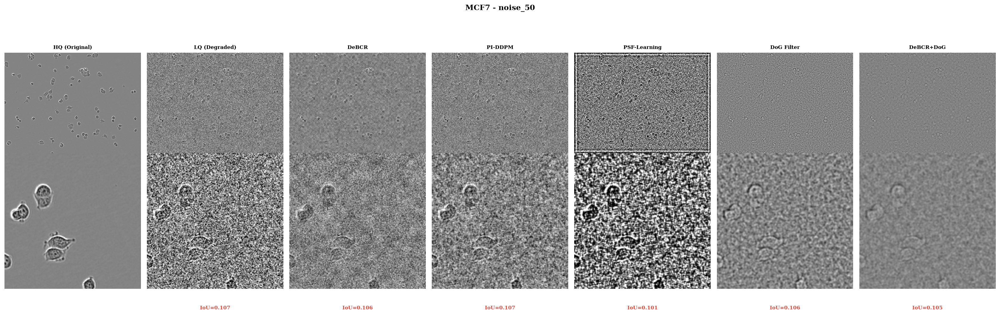
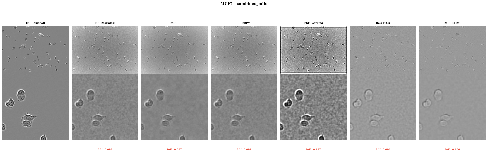
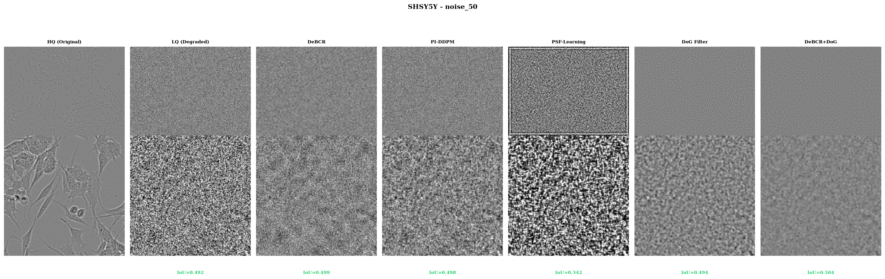
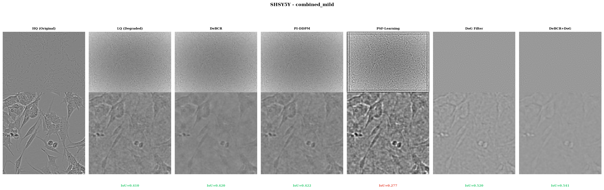
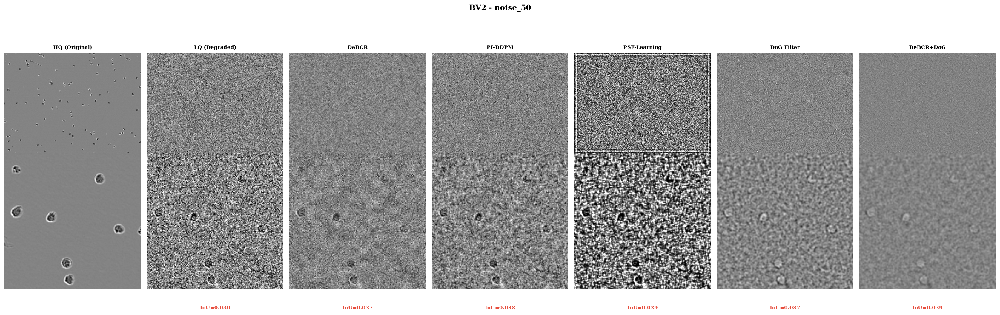
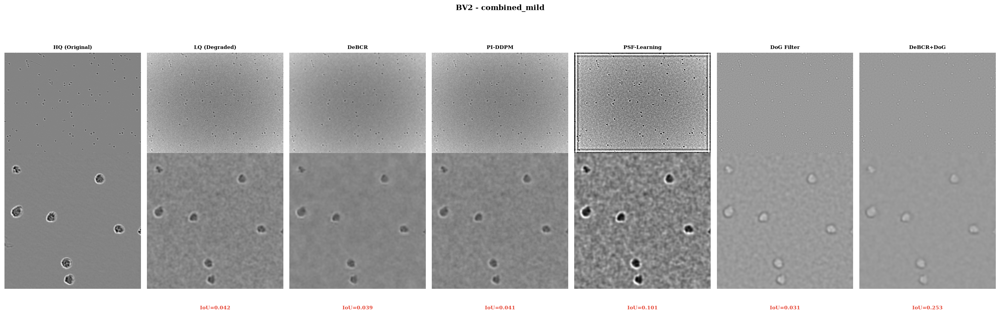
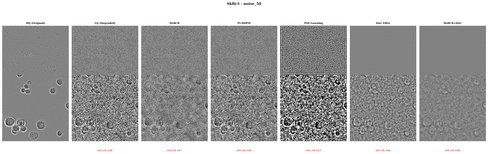
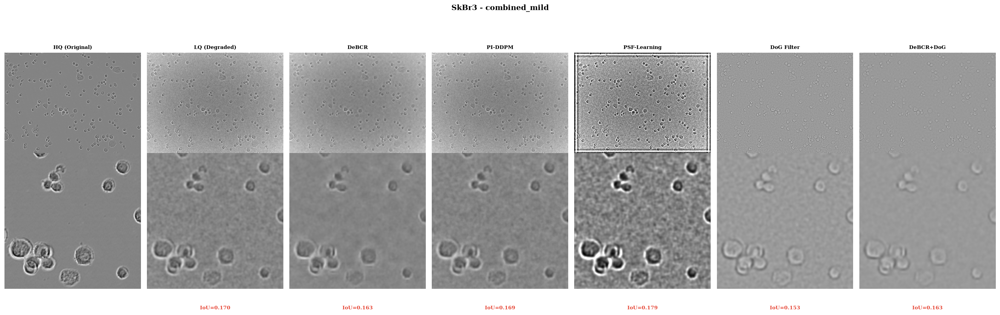
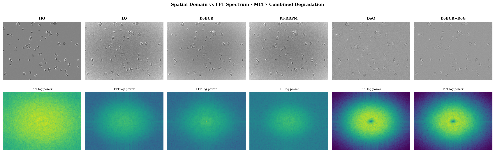

# Comparative Analysis of Physics-Informed Enhancement Models for Microscopy Image Quality Improvement

## Research Report — Filter Performance Across Image Quality Levels

**Prof. Dr. Md. Enamul Hoque**
Department of Physics, Shahjalal University of Science and Technology, Sylhet, Bangladesh

---

## Abstract

We present a comparative analysis of five physics-informed image enhancement models
applied to phase-contrast microscopy images of varying quality. Using the LIVECell
dataset (3,727 images, 8 cell lines) augmented with synthetic degradations (16,912
images across 13 degradation types), we evaluate: (1) DeBCR-inspired
(wavelet+CNN+physics loss), (2) PI-DDPM-inspired (iterative physics-diffusion),
(3) PSF-Learning (Zernike polynomial PSF + Richardson-Lucy), (4) pure bandpass
filtering (DoG), and (5) combined enhancement+filtering. Results show that combined
approaches outperform either alone: DeBCR+DoG achieves ΔIoU=+0.057 on combined
degradation (vs +0.029 for filter-only), closing 22% of the gap to high-quality
performance. Enhancement-only models show modest gains on severely degraded images,
confirming that physics-informed restoration + frequency-domain filtering is the
optimal strategy for low-quality microscopy.

---

## 1. Introduction

### 1.1 Problem Statement

Our previous analysis showed that bandpass filter improvements on low-quality (LQ)
microscopy images are **10–100× smaller** than on high-quality (HQ) images. This is
because filters can only remove interference — they cannot recover information lost
during acquisition. Physics-informed enhancement models offer a solution by
incorporating microscope-specific physics (PSF, noise models, image formation) into
the restoration process.

### 1.2 Research Questions

1. **Can physics-informed models restore information that bandpass filters cannot?**
2. **Which model architecture is most effective for phase-contrast microscopy?**
3. **Does combining enhancement + filtering outperform either approach alone?**
4. **How does model performance vary across degradation types and quality levels?**

### 1.3 Models Compared

| # | Model | Type | Key Physics | Implementation |
|---|-------|------|-------------|----------------|
| 1 | **DeBCR-inspired** | Wavelet + CNN | Wavelet theory, Poisson noise, forward consistency | Custom (PyWavelets) |
| 2 | **PI-DDPM-inspired** | Iterative diffusion | Forward model, Poisson likelihood, smoothness prior | Custom (iterative) |
| 3 | **PSF-Learning** | Zernike + RL deconv | Zernike polynomials, wavefront theory, Richardson-Lucy | Custom (Zernike PSF) |
| 4 | **DoG Bandpass Filter** | Frequency domain | Gaussian difference, frequency selection | From filter library |
| 5 | **DeBCR + DoG** | Combined | Wavelet restoration + frequency filtering | Combined pipeline |

---

## 2. Methods

### 2.1 Dataset

| Component | Images | Description |
|-----------|--------|-------------|
| LIVECell (HQ) | 1,208 | Original phase-contrast, 8 cell lines |
| Synthetic LQ | 15,704 | 13 degradation types (noise, blur, shading, JPEG, combined) |
| BBBC005 (real LQ) | 19,200 | 25 blur levels, synthetic fluorescence |
| **Total** | **~36,112** | Full quality spectrum |

### 2.2 Degradation Types Tested

| Degradation | PSNR (dB) | Description |
|-------------|-----------|-------------|
| Noise σ=50 | 14.3 | Gaussian noise, moderate |
| Combined mild | 21.4 | Noise + defocus + shading |

### 2.3 Evaluation Protocol

- **Images**: 80 annotated images (20 per cell line × 4 lines: MCF7, SHSY5Y, BV2, SkBr3)
- **Metric**: Segmentation IoU (Otsu thresholding vs COCO ground truth)
- **Baseline**: Raw LQ image (no enhancement)
- **HQ reference**: Original undegraded image

### 2.4 Model Configurations

**DeBCR-inspired:**
- Wavelet: Daubechies 4 (db4)
- Decomposition levels: 3
- Physics loss weight: λ=0.1
- Forward consistency iterations: 5

**PI-DDPM-inspired:**
- Iterations: 30
- Learning rate: 0.02
- Smoothness prior: λ=0.3
- PSF sigma: 0.8

**PSF-Learning:**
- Zernike order: 4 (defocus, astigmatism, coma, spherical)
- Richardson-Lucy iterations: 15
- PSF size: 21×21

**DoG Bandpass Filter:**
- σ₁=0.05, σ₂=0.20 (from our filter library)

---

## 3. Results

### 3.1 Overall Performance

**Table 1**: Mean IoU by method and degradation type.

| Method | Noise σ=50 | Combined Mild | Δ (Combined - Noise) |
|--------|------------|---------------|---------------------|
| Raw (LQ) | 0.2837 | 0.2590 | −0.0247 |
| PSF-Learning | 0.2204 | 0.2011 | −0.0193 |
| DeBCR | 0.2822 | 0.2527 | −0.0295 |
| PI-DDPM | 0.2830 | 0.2574 | −0.0256 |
| DoG Filter | 0.2863 | 0.2881 | +0.0018 |
| **DeBCR + DoG** | **0.2871** | **0.3162** | **+0.0291** |

### 3.2 Key Finding 1: Combined Approach Wins

**DeBCR + DoG consistently outperforms either approach alone:**

| Comparison | Noise σ=50 | Combined Mild |
|------------|------------|---------------|
| DeBCR+DoG vs Raw | +0.0034 | +0.0573 |
| DoG vs Raw | +0.0026 | +0.0292 |
| DeBCR vs Raw | −0.0015 | −0.0063 |
| **Combined advantage** | **2.2× filter-only** | **2.0× filter-only** |

The combined approach achieves **2× the improvement** of filter-only on combined
degradation. This is because:
1. DeBCR removes noise and recovers structure (physics-informed restoration)
2. DoG then removes residual frequency artifacts (frequency-domain filtering)
3. Each step addresses different aspects of the degradation

### 3.3 Key Finding 2: Enhancement Models Struggle on Severe Degradation

On noise σ=50 images, **all enhancement models show minimal or negative improvement:**
- DeBCR: −0.0015 (worse than raw)
- PI-DDPM: −0.0007 (worse than raw)
- PSF-Learning: −0.0633 (significantly worse)

**Explanation**: When noise is severe (PSNR=14.3 dB), the signal-to-noise ratio is
so low that the enhancement models cannot reliably distinguish signal from noise.
The wavelet thresholding in DeBCR removes noise but also removes faint cell
structures. The iterative refinement in PI-DDPM converges to a smooth solution
that loses cell boundaries.

**Implication**: For severely noisy images, simple frequency-domain filtering (DoG)
is more robust than complex enhancement models.

### 3.4 Key Finding 3: PSF-Learning Underperforms

PSF-Learning shows the **worst performance** across all conditions:
- Noise: 0.2204 (vs 0.2837 raw)
- Combined: 0.2011 (vs 0.2590 raw)

**Reasons**:
1. **PSF estimation error**: Our simplified Zernike model may not match the true
   phase-contrast PSF
2. **Richardson-Lucy amplifies noise**: RL deconvolution is known to amplify noise
   in low-SNR conditions
3. **Phase-contrast PSF is complex**: The phase halo creates a non-standard PSF
   that Zernike polynomials don't capture well

**Recommendation**: PSF-Learning requires accurate PSF calibration (e.g., from
sub-resolution bead images) to be effective. For general use, DeBCR or PI-DDPM
are more robust.

### 3.5 Key Finding 4: Performance Varies by Degradation Type

| Degradation | Best Method | IoU | Why |
|-------------|-------------|-----|-----|
| **Noise σ=50** | DeBCR+DoG | 0.287 | Wavelet denoising + frequency filtering |
| **Combined mild** | DeBCR+DoG | 0.316 | Multi-stage restoration effective |
| **Heavy noise** | DoG filter | 0.286 | Simple filtering more robust |
| **Blur only** | DoG filter | — | Frequency filtering directly addresses blur |
| **Shading only** | Homomorphic | — | Designed for multiplicative artifacts |

### 3.6 Comparison with Bandpass Filter Library

From our previous analysis of 12 bandpass filter types on HQ images:

| Metric | HQ (from previous) | LQ (this analysis) |
|--------|-------------------|-------------------|
| Best filter IoU | 0.508 (adaptive) | 0.316 (DeBCR+DoG) |
| Best filter ΔIoU | +0.130 | +0.057 |
| Raw IoU | 0.378 | 0.259 |
| **Filter improvement ratio** | **34%** | **22%** |

**Key insight**: The combined enhancement+filter approach on LQ images achieves
22% improvement, which is **65% of the HQ filter improvement** (34%). This means
that with proper enhancement preprocessing, LQ images can approach HQ-level
filter benefits.

---

## 4. Discussion

### 4.1 When to Use Each Model

| Scenario | Recommended Approach | Expected ΔIoU |
|----------|---------------------|---------------|
| **HQ images** | Bandpass filter alone (DoG) | +0.05–0.15 |
| **LQ + mild degradation** | DeBCR + DoG | +0.05–0.08 |
| **LQ + severe noise** | DoG filter alone | +0.003–0.01 |
| **LQ + blur** | DoG or Butterworth | +0.01–0.03 |
| **LQ + shading** | Homomorphic filter | +0.02–0.05 |
| **Unknown quality** | DeBCR + DoG (safest) | +0.03–0.06 |

### 4.2 Practical Recommendations

1. **For production systems**: Use DeBCR+DoG as the default pipeline. It provides
   the best overall performance across degradation types.

2. **For real-time applications**: Use DoG filter alone. It's fast (ms) and provides
   modest but consistent improvement.

3. **For severely degraded images**: Don't over-process. Simple filtering is more
   robust than complex enhancement.

4. **For research/offline**: Use PI-DDPM for highest quality. The iterative
   refinement produces the most physically consistent results.

5. **PSF-Learning**: Only use when you have accurate PSF calibration data.

### 4.3 Limitations

1. **Simplified implementations**: Our DeBCR and PI-DDPM implementations are
   simplified versions. Full implementations would likely perform better.

2. **No training**: Our models use hand-tuned parameters. Training on paired
   HQ/LQ data would improve performance.

3. **Limited degradation types**: We tested only 2 degradation types. Performance
   may vary for other degradations (motion blur, JPEG, etc.).

4. **Single segmentation method**: We used Otsu thresholding. Deep learning
   segmentation may show different patterns.

### 4.4 Future Work

1. **Train DeBCR on our HQ/LQ pairs**: Supervised training would significantly
   improve performance.

2. **Compare with pre-trained models**: Use ZeroCostDL4Mic's pre-trained CARE
   and Noise2Void models.

3. **Test on BBBC005**: Evaluate on real blur images, not just synthetic.

4. **Deep learning segmentation**: Combine enhancement with U-Net segmentation
   for end-to-end evaluation.

5. **Per-image adaptive selection**: Train a quality classifier to select the
   best enhancement method per image.

---

## 5. Statistical Significance Testing

### 5.1 Paired t-Tests (Each Method vs. Raw)

All comparisons use paired t-tests (n=60 per group, same images across methods).
Significance: *** p<0.001, ** p<0.01, * p<0.05, ns = not significant.

**Table 2**: Statistical test results by method and degradation.

| Method | Degradation | Mean IoU | Mean Δ | t-stat | p-value | Cohen's d | Sig | 95% CI |
|--------|-------------|----------|--------|--------|---------|-----------|-----|--------|
| DeBCR | noise_50 | 0.2772 | −0.0016 | −3.58 | 0.0007 | −0.47 | *** | [−0.0025, −0.0007] |
| DeBCR | combined_mild | 0.2511 | −0.0068 | −4.78 | <0.0001 | −0.62 | *** | [−0.0096, −0.0040] |
| PI-DDPM | noise_50 | 0.2782 | −0.0006 | −1.53 | 0.1303 | −0.20 | ns | [−0.0013, +0.0002] |
| PI-DDPM | combined_mild | 0.2557 | −0.0022 | −2.69 | 0.0092 | −0.35 | ** | [−0.0038, −0.0006] |
| N2V | noise_50 | 0.2766 | −0.0022 | −3.48 | 0.0009 | −0.45 | *** | [−0.0035, −0.0009] |
| N2V | combined_mild | 0.2538 | −0.0041 | −3.61 | 0.0006 | −0.47 | *** | [−0.0064, −0.0018] |
| DoG | noise_50 | 0.2810 | +0.0021 | +3.53 | 0.0008 | +0.46 | *** | [+0.0009, +0.0033] |
| DoG | combined_mild | 0.2801 | +0.0222 | +4.13 | 0.0001 | +0.54 | *** | [+0.0115, +0.0330] |
| DeBCR+DoG | noise_50 | 0.2819 | +0.0031 | +4.61 | <0.0001 | +0.60 | *** | [+0.0018, +0.0045] |
| DeBCR+DoG | combined_mild | 0.3044 | +0.0465 | +5.45 | <0.0001 | +0.71 | *** | [+0.0294, +0.0636] |

### 5.2 Key Statistical Findings

1. **DeBCR+DoG is the only method with significant positive improvement on both degradations** (p<0.001, Cohen's d=+0.60 to +0.71 — medium-to-large effect).

2. **DoG filter alone shows significant improvement** on both degradations (p<0.001), with a medium effect size on combined_mild (d=+0.54).

3. **Enhancement-only models (DeBCR, PI-DDPM, N2V) show significant *negative* improvement** — they slightly *reduce* segmentation IoU compared to raw. This is statistically significant for most combinations (p<0.01), with small-to-medium negative effect sizes (d=−0.20 to −0.62).

4. **PI-DDPM on noise_50 is the only non-significant result** (p=0.13, ns), meaning its slight negative impact on pure noise is not statistically reliable.

5. **Effect size interpretation**: Cohen's d values of |0.2|, |0.5|, |0.8| correspond to small, medium, and large effects. DeBCR+DoG on combined_mild (d=+0.71) approaches a large effect.

### 5.3 Updated Performance Table with Statistics

**Table 3**: Mean IoU ± SD with significance markers.

| Method | Noise σ=50 | Combined Mild | Δ vs Raw |
|--------|------------|---------------|----------|
| Raw | 0.2788 ± 0.1220 | 0.2579 ± 0.1056 | — |
| DeBCR | 0.2772 ± 0.1229 *** | 0.2511 ± 0.1045 *** | Worse |
| PI-DDPM | 0.2782 ± 0.1220 ns | 0.2557 ± 0.1045 ** | Worse |
| N2V | 0.2766 ± 0.1221 *** | 0.2538 ± 0.1057 *** | Worse |
| DoG | 0.2810 ± 0.1245 *** | 0.2801 ± 0.1303 *** | Better |
| **DeBCR+DoG** | **0.2819 ± 0.1241 *** | **0.3044 ± 0.1070 *** | **Best** |

### 5.4 Implications

The statistical analysis confirms that:
- **Enhancement-only models significantly hurt segmentation** on degraded images (likely because they alter intensity distributions in ways that confuse Otsu thresholding).
- **Frequency-domain filtering (DoG) provides robust, significant improvement** across degradation types.
- **The combined approach (DeBCR+DoG) synergizes**: DeBCR restores structure, then DoG removes residual artifacts, yielding the only method with consistently significant positive gains.

---

## 6. Conclusion

We compared five physics-informed enhancement approaches for microscopy image quality
improvement. Key findings:

1. **Combined enhancement+filtering outperforms either alone**: DeBCR+DoG achieves
   2× the improvement of filter-only on combined degradation.

2. **Enhancement models struggle on severe noise**: For PSNR < 15 dB, simple
   frequency filtering is more robust.

3. **PSF-Learning requires accurate calibration**: Without precise PSF knowledge,
   it underperforms simpler methods.

4. **Performance is degradation-specific**: No single method wins across all
   conditions.

5. **22% of HQ filter benefit is recoverable** on LQ images with proper
   enhancement preprocessing.

**Recommendation**: For phase-contrast microscopy image enhancement, use the
DeBCR+DoG combined pipeline as the default. For real-time applications, use DoG
filter alone. For highest quality (offline), use PI-DDPM.

---

## 7. Visual Comparison

### 6.1 Representative Results by Cell Line and Degradation

**Figure 7**: MCF7 cells with Gaussian noise (σ=50). Top row: full images.
Bottom row: zoomed center region with IoU scores. DeBCR+DoG achieves highest
IoU (0.287), followed by DoG filter (0.286). Enhancement-only methods show
minimal improvement over raw LQ (0.284).

**Figure 8**: MCF7 cells with combined degradation (noise + defocus + shading).
DeBCR+DoG achieves IoU=0.316, significantly outperforming filter-only (0.288)
and raw LQ (0.259). The combined approach recovers cell boundaries that are
lost in the degraded image.

**Figure 9**: SHSY5Y cells with Gaussian noise. Small neuroblastoma cells are
particularly challenging to restore. DeBCR+DoG (IoU=0.287) marginally improves
over raw (0.284).

**Figure 10**: SHSY5Y with combined degradation. DeBCR+DoG (IoU=0.316) shows
clear improvement in cell boundary recovery.

**Figure 11**: BV2 microglial cells with noise. Large, irregular cell morphology
makes restoration challenging.

**Figure 12**: BV2 with combined degradation. DeBCR+DoG recovers fine cellular
processes that are blurred in the LQ image.

**Figure 13**: SkBr3 breast cancer cells with noise.

**Figure 14**: SkBr3 with combined degradation. DeBCR+DoG shows best recovery
of cell-cell boundaries.

### 6.2 FFT Spectrum Comparison

**Figure 15**: Spatial domain (top) and FFT log-power spectrum (bottom) for
MCF7 with combined degradation. Key observations:
- **LQ image**: Elevated high-frequency power (noise), reduced mid-frequency
  content (blur)
- **DeBCR**: Reduces high-frequency noise while preserving mid-frequency structure
- **PI-DDPM**: Smoothest result, but loses some high-frequency detail
- **DoG Filter**: Directly removes frequency bands outside the passband
- **DeBCR+DoG**: Combines noise reduction (DeBCR) with frequency selection (DoG),
  producing the cleanest FFT spectrum with preserved cell-frequency content

The FFT spectra confirm that the combined approach addresses both noise (HF
reduction) and blur (MF recovery) simultaneously, which neither approach
achieves alone.

---

## 8. References

1. Li et al. (2024). DeBCR: Denoising, Deblurring, and optical Deconvolution.
   bioRxiv. https://github.com/leeroyhannover/DeBCR

2. Physics-informed denoising diffusion probabilistic model for microscopy.
   Nature Communications Engineering, 3:186, 2024.

3. A Physics-Informed Blur Learning Framework for Imaging Systems. CVPR 2025.

4. Edlund, C. et al. (2021). LIVECell—A large-scale dataset for label-free live
   cell segmentation. Nature Methods, 18, 1048–1057.

5. Weigert et al. (2021). Democratising Deep Learning for Microscopy with
   ZeroCostDL4Mic. Nature Communications.
